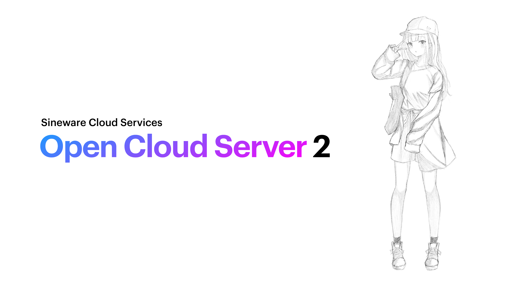

# Sineware Cloud Services API Server
Open Cloud Server 2 (OCS2, Formerly "cloud-api")


Sineware OCS2 is the main backend server powering Sineware Cloud Services. It's written in Swift using the Vapor framework.

> Currently under development! Sineware Cloud Services is not available for use.

```text
This program is free software: you can redistribute it and/or modify
it under the terms of the GNU Affero General Public License as published
by the Free Software Foundation, either version 3 of the License, or
(at your option) any later version.
```

## API Documentation

### HTTP API
The HTTP API of OCS2 is used for authentication services, update server and other basic requests.

TODO!

### Websocket Gateway
The Websocket Gateway is the main realtime communication channel for the [Cloud Portal](https://github.com/Sineware/cloud-portal) and the [ProLinux](https://github.com/sineware/prolinuxd-java) daemon.


## Installing
Requirements:
* Swift
* PostgreSQL

Running for development:
```shell
swift run
```