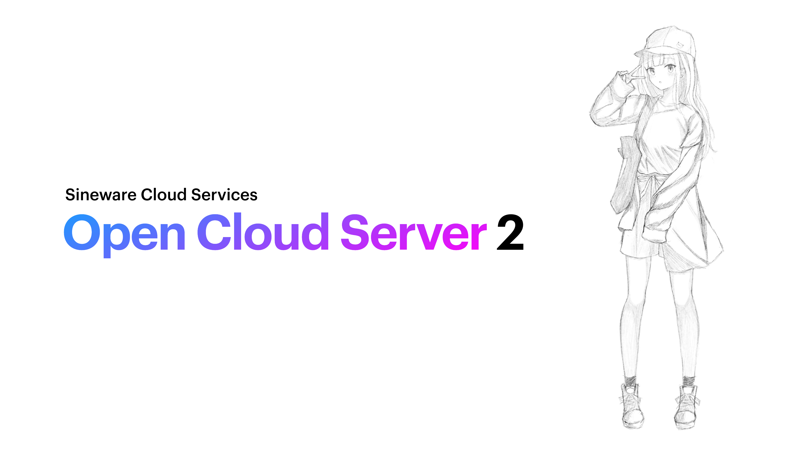

# Sineware Cloud Services API Server
Open Cloud Server 2 (OCS2, Formerly "cloud-api")


Sineware OCS2 is the main backend server powering Sineware Cloud Services, implementing the v1 API (and is a rewrite of cloud-api and authserver).

> Currently under development!

```text
This program is free software: you can redistribute it and/or modify
it under the terms of the GNU Affero General Public License as published
by the Free Software Foundation, either version 3 of the License, or
(at your option) any later version.
```

## API Documentation

### HTTP API
The HTTP API of OCS2 is used for authentication services, update server and other basic requests.

TODO!

### Websocket Gateway
The Websocket Gateway is the main realtime communication channel for the [Cloud Portal](https://github.com/Sineware/cloud-portal) and the [ProLinux]() daemon.

### BITp (Binary Intracloud Transport Protocol)
BITp is the TCP socket protocol used for connections between OCS2 and OCE (Open Cloud Edge) servers, using the binary BSON standard.

OCE instances live in geographically distributed edge servers and terminate HTTP and WebSockets connections from clients, and 
sends the requests over the BITp connection to OCS2.

For simple deployments, OCE servers are not necessary, as clients can connect directly to endpoints exposed by OCS2, however 
large deployments (such as the main Sineware Cloud Services deployment) should use multiple OCE servers feeding into OCS2.

[View the BITp specification.](#)

## Installing
Requirements:
* PostgreSQL
* Node v16

Running for development:
```shell
npm i
npm start
```